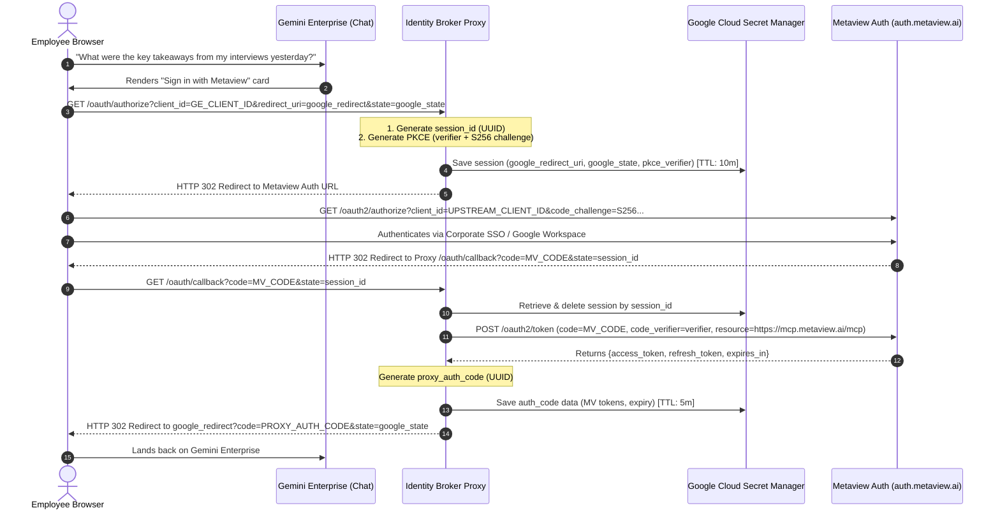
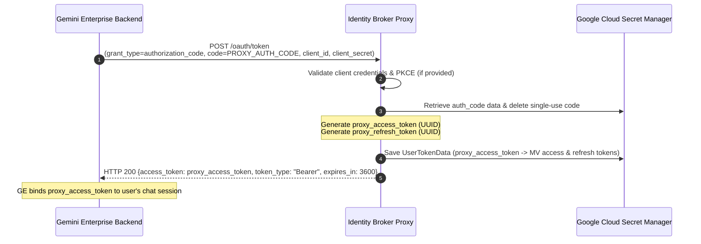
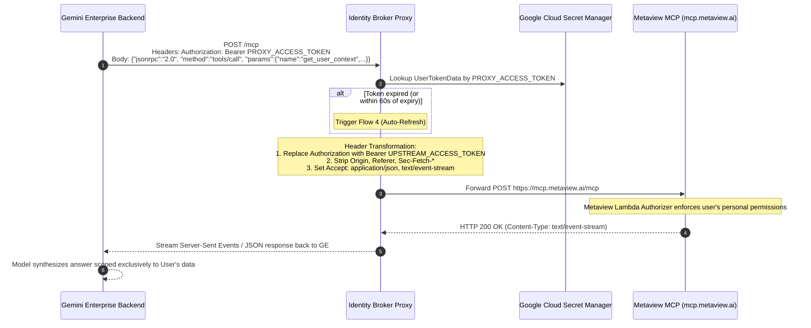

# Architecture

How the Identity Broker Proxy bridges Gemini Enterprise and Model Context Protocol (MCP) SaaS services to provide an enterprise-grade integration.

- [Enterprise Cloud Governance vs. Desktop Tooling Models](#1-enterprise-cloud-governance-vs-desktop-tooling-models)
- [Multi-Vendor Separation of Concerns](#2-multi-vendor-separation-of-concerns-dedicated-cloud-run-instances)
- [Request flows](#3-how-it-does-it-architecture--technical-flows)
- [Upstream service behaviours](#4-vendor-case-study-metaview)

Related: [Deployment](DEPLOYMENT.md) · [Security](SECURITY.md) · [Testing](TESTING.md) · [Agent Registry](AGENT_REGISTRY.md)

---

## 1. Enterprise Cloud Governance vs. Desktop Tooling Models

### The Architectural Context

Integrating enterprise AI platforms with external Model Context Protocol (MCP) servers requires reconciling two distinct software delivery models:

```
+-------------------------------------------------------------+               +-------------------------------------------------------------+
|        Gemini Enterprise (Custom MCP Server)                |               |             Desktop-Centric MCP Server Model                |
|   Governed, Multi-Tenant Enterprise Cloud Platform          |               |          Single-User Desktop Developer Application          |
+-------------------------------------------------------------+               +-------------------------------------------------------------+
| • Multi-User Enterprise: Governed corporate tenant access   |  ENTERPRISE   | • Single-User Desktop: Built for Cursor / Claude Desktop    |
| • Mandates RFC 6749 static client_id & PKCE verification    |    BRIDGE     | • Mandates RFC 7591 Dynamic Client Registration & PKCE only |
| • Managed Enterprise Redirect URI (Audited domain)          | <===========> | • Localhost or dynamic schemes (No Admin Console Whitelist) |
| • Standard Enterprise JSON-RPC Client                       |               | • Requires Accept: application/json, text/event-stream      |
| • Standard Cloud Egress Headers                             |               | • Upstream API Gateway filters browser Origin headers       |
| • Enforces strict per-user corporate data boundaries        |               | • Requires individual user OAuth tokens per data partition  |
+-------------------------------------------------------------+               +-------------------------------------------------------------+
```

### 1.1 Gemini Enterprise's Paradigm: Enterprise Governance & Identity Boundaries
Gemini Enterprise is designed for corporate enterprise environments serving employees across an organization:
- **Pre-Provisioned, Audited Credentials:** Gemini Enterprise operates under standard **RFC 6749 / RFC 7636 (PKCE)** OAuth models. Enterprise IT and SecOps teams configure pre-approved, audited client credentials in Google Cloud Console, preventing unauthorized shadow IT applications from accessing enterprise tenants.
- **Centrally Managed Enterprise Redirect URI:** Google uses a standardized, secure redirect URI across enterprise deployments (`https://vertexaisearch.cloud.google.com/oauth-redirect`). This ensures all authorization code redirects terminate exclusively on Google-managed, verified endpoints.
- **Strict Per-User Identity & Data Isolation:** Gemini Enterprise binds conversational AI queries to the authenticated employee's corporate identity, ensuring that queries only return data the individual user has legitimate clearance to view.

### 1.2 Upstream SaaS Providers: The Desktop-First Architecture
In contrast, many emerging MCP gateways (such as Metaview, Carta, or developer-focused MCP servers) were originally engineered for single-user desktop developer applications (e.g. **Cursor**, **Claude Desktop**, or local CLI runtimes):
- **Localhost & Custom URI Assumptions:** Desktop applications run on an employee's workstation, authenticating via temporary local listeners (`http://localhost:<port>/callback`) or custom OS protocol schemes.
- **Dynamic Client Registration (RFC 7591):** Because desktop clients cannot securely store pre-shared secrets, these services expect clients to register themselves dynamically on the fly rather than through an IT administrator console.
- **Strict Public PKCE & Gateway Rules:** Desktop-first gateways mandate public PKCE (`token_endpoint_auth_method: "none"`), reject requests missing Server-Sent Event headers (`Accept: application/json, text/event-stream`) with **HTTP 406**, and filter browser `Origin` headers with **HTTP 403**.

### 1.3 The Anti-Pattern: Why Shared Static API Keys Cannot Be Used
Faced with integrating desktop-oriented MCP servers into enterprise cloud environments, teams sometimes consider wrapping the service with a single static service account key.

**In an enterprise context, a shared key is a critical compliance violation:**
- **Collapsing Access Boundaries:** Candidate interview evaluations, compensation notes, cap table equity, or hiring deliberations are strictly permissioned per employee and team. A shared key collapses the entire enterprise onto a single shared identity.
- **Confidential Data Exposure:** An employee querying Gemini Enterprise could inadvertently receive executive compensation data or confidential evaluations they are not authorized to view.
- **Compliance Violations:** Breaches **SOC 2 Type II** least-privilege principles, **GDPR** data minimization, and corporate confidentiality policies.

### 1.4 The Solution: An Enterprise Identity Broker on Google Cloud Run
This Google Cloud Run Identity Broker serves as the enterprise bridge:
1. **Complies with Gemini Enterprise's Governance:** Serves as a standard RFC 6749 authorization server with static credentials, PKCE verification, and managed redirect handling.
2. **Negotiates Dynamic Client Registration with Upstream SaaS:** Dynamically registers redirect URIs and handles PKCE negotiation with upstream providers.
3. **Maintains 1:1 Per-User Token Isolation in Secret Manager:** Encrypts each employee's upstream OAuth token under a distinct secret version governed by native Secret Manager TTL policies.
4. **Performs Real-Time Protocol & Header Transformation:** Normalizes browser headers, negotiates Server-Sent Events, and transparently refreshes expired tokens.

### Summary Architectural Comparison

| Architectural Requirement | Gemini Enterprise (Enterprise Cloud Standards) | Desktop-Centric MCP Server Model | How This Identity Broker Proxy Bridges It |
| :--- | :--- | :--- | :--- |
| **Client Registration** | Standard pre-registered credentials in Google Cloud Console. | Built for local desktop clients; expects RFC 7591 DCR or public PKCE. | Proxy provides standard RFC 6749 static credentials to GE and negotiates dynamic PKCE with upstream provider. |
| **Redirect URI** | Managed enterprise URI: `https://vertexaisearch.cloud.google.com/oauth-redirect`. | Validates redirect URIs against registered client domains; lacks a self-service console to register Google's URI. | Proxy provides `/oauth/callback`, captures upstream auth code, and forwards the browser to Google's redirect URI. |
| **Content Negotiation** | Standard enterprise JSON-RPC client. | Upstream gateway requires `Accept: application/json, text/event-stream` (HTTP 406 otherwise). | Proxy injects required headers and handles Server-Sent Events (SSE) translation. |
| **Origin Headers** | Standard enterprise browser/cloud headers. | Upstream API Gateway filters unwhitelisted `Origin` and `Referer` with HTTP 403. | Proxy sanitizes browser-specific headers (`Origin`, `Referer`, `Sec-Fetch-*`) before forwarding. |
| **Per-User Isolation** | Binds user chat sessions to issued bearer tokens. | Requires user-specific OAuth access tokens for data isolation. | Proxy maps GE session tokens 1:1 to each user's upstream tokens encrypted in Google Cloud Secret Manager. |

---

## 2. Multi-Vendor Separation of Concerns: Dedicated Cloud Run Instances

Rather than running a monolithic multi-tenant broker that routes to multiple SaaS vendors internally, the recommended enterprise pattern is **running a separate, dedicated Cloud Run instance per SaaS vendor** (e.g. `ge-metaview-proxy`, `ge-carta-proxy`, `ge-greenhouse-proxy`).

### Why Separate Cloud Run Instances per Vendor?

1. **Failure Domain & Blast Radius Isolation:**
   Each vendor's token lifecycle, quota thresholds, and availability are isolated. An outage, API rate limit, or token revocation spike on one SaaS platform has zero impact on users querying other services.

2. **Secret Manager Namespace Isolation:**
   Each vendor instance operates within its own dedicated Secret Manager prefix. `deploy.sh` derives it as `ge-<first four characters of VENDOR>`, so the presets produce `ge-meta-*` for Metaview, `ge-cart-*` for Carta and `ge-gree-*` for Greenhouse. It can be overridden with `SECRET_PREFIX`; the application default when nothing is set is `ge-mcp`. This prevents cross-service credential leakage and simplifies compliance auditing.

3. **1:1 Alignment with Gemini Enterprise MCP Registrations:**
   In Gemini Enterprise, each Custom MCP Server is registered with a distinct tuple:
   - MCP Server URL: `https://<service-url>/mcp`
   - Authorization URL: `https://<service-url>/oauth/authorize`
   - Token URL: `https://<service-url>/oauth/token`
   Dedicated Cloud Run services provide clean, distinct endpoint tuples that map directly to Google's registration model without complex path routing.

4. **Independent Autoscaling & Resource Allocation:**
   Different MCP tools have vastly different query volumes and response latencies (e.g., streaming interview transcripts vs. querying cap tables). Cloud Run automatically scales each service from zero independently based on actual traffic demand.

5. **Least-Privilege Service Accounts:**
   Each vendor proxy can run with its own Google Cloud Service Account, ensuring that secret access and auditing are strictly scoped per vendor.

---

## 3. How It Does It: Architecture & Technical Flows

### High-Level Topology

> [!NOTE]
> The diagrams in this section use Metaview as a **worked example**, not as the
> product. The flow is identical for any OAuth 2.0 + PKCE MCP provider — substitute
> that provider's own authorization, token and MCP endpoints.

```
+------------------+         +-------------------------------------------------------------+         +---------------------+
|   End Users      |         |                     Google Cloud Tenant                     |         |     Metaview.ai     |
|                  |         |                                                             |         |                     |
|  [ User A (Chat) ]=======>| [ Gemini Enterprise App ]                                   |         |                     |
|  [ User B (Chat) ]=======>|        |                                                    |         |                     |
|                  |         |        | Per-User Proxy Bearer Token                        |         |                     |
|                  |         |        v                                                    |         |                     |
|                  |         | +---------------------------------------------------------+ |         |                     |
|                  |         | | Cloud Run Identity Broker Proxy                         | |         |                     |
|                  |         | |                                                         | |         |                     |
| [ Browser 3-Legged ]=======>| |  * /oauth/authorize  (Mediates login to Metaview)       | |========>| [ Metaview Auth ]   |
| [ Sign-In Flow     ]<=======| |  * /oauth/callback   (Captures user Metaview token)    | |<========| (Login / SSO)       |
|                  |         | |  * /oauth/token      (Mints proxy token to Google)      | |         |                     |
|                  |         | |  * /mcp              (Swaps token & proxies JSON-RPC)   | |========>| [ Metaview MCP ]    |
|                  |         | +---------------------------------------------------------+ |         | (mcp.metaview.ai)   |
|                  |         |          |                                                  |         +---------------------+
|                  |         |          v                                                  |
|                  |         | [ Google Cloud Secret Manager ]                             |
|                  |         | (Encrypted Per-User Token Storage with native TTL)          |
|                  |         |  * ge-meta-sess-<uuid> (OAuth Session, TTL: 10m)            |
|                  |         |  * ge-meta-code-<uuid> (Proxy Auth Code, TTL: 5m)           |
|                  |         |  * ge-meta-tok-<uuid>  (User Tokens, Versioned)             |
|                  |         +-------------------------------------------------------------+
+------------------+
```

---

### Flow 1: 3-Legged Interactive Browser Sign-In



---

### Flow 2: Backend Proxy Token Minting



---

### Flow 3: Runtime MCP Tool Execution & Token Swap



---

### Flow 4: Transparent Token Auto-Refresh

Metaview access tokens have an expiration lifetime (typically 1 hour). The proxy handles token renewal automatically:

1. **Preemptive Refresh:** When an MCP request arrives, the proxy checks `upstream_expires_at` on the stored token record. If the token expires in less than 60 seconds, the proxy calls the upstream token endpoint (`grant_type=refresh_token`) before forwarding the request.
2. **Reactive 401 Recovery:** If Metaview's Lambda Authorizer revokes or rejects a token with `HTTP 401 Unauthorized`, the proxy automatically catches the response, invokes `refresh_access_token()`, updates Secret Manager with the new version, and retries the upstream MCP call once.
3. **Zero Interruption:** The end user in Gemini Enterprise never experiences an unexpected session expiration or sign-in prompt during active work.

---

### Storage Architecture: Google Cloud Secret Manager with Native TTL

Unlike architectures relying on Cloud Firestore or Redis, this proxy utilizes **Google Cloud Secret Manager exclusively**.

Secret IDs are namespaced by `SECRET_PREFIX`, written below as `<prefix>`. `deploy.sh`
derives it as `ge-<first four characters of VENDOR>`, so the Metaview preset yields
`ge-meta` — the value used in the example tree.

- **Ephemeral Sessions (`<prefix>-sess-<session_id>`):** Created when user starts OAuth. Configured with native Secret Manager TTL (`ttl: 600s`). Secret Manager automatically purges the secret after 10 minutes.
- **Single-Use Auth Codes (`<prefix>-code-<code_id>`):** Created when the upstream provider redirects back. Configured with native TTL (`ttl: 300s`). Immediately deleted upon exchange at `/oauth/token`.
- **Active User Tokens (`<prefix>-tok-<proxy_token>`):** Stored encrypted at rest with automatic Google-managed encryption keys (or CMEK). Retains token versions and supports Cloud Audit Logging for compliance.

Every secret the broker creates carries the label `app=ge-mcp-auth-proxy`, which is what
the cleanup and audit commands in [Security](SECURITY.md) filter on.

```
projects/<YOUR_PROJECT_ID>/secrets/
├── ge-meta-sess-4f81c962-e932-4886-b489-0c68ea7a7c73  (TTL: 10m)
├── ge-meta-code-8931b2e1-4567-4e92-9111-df23b7a81234  (TTL: 5m)
└── ge-meta-tok-8a4591ad-64fe-4d4d-b654-b2e912fdf2b4   (Active Session)
    ├── versions/1 (Initial tokens)
    └── versions/2 (Refreshed tokens)
```

The stored token record uses vendor-neutral field names — `upstream_access_token`,
`upstream_refresh_token`, `upstream_expires_at`, `upstream_code_verifier`. Earlier
`metaview_*` aliases no longer exist.


---

## 4. Vendor Case Study: Metaview

> [!NOTE]
> This section is **one worked example**, not universal MCP behaviour. It documents the
> specific quirks encountered integrating Metaview, because they illustrate the class of
> problem this broker solves. Carta and Greenhouse have different endpoints, scopes and
> auth methods — see the presets in [`deploy.sh`](../deploy.sh).
>
> Every provider's real configuration should be read from its own discovery documents:
>
> ```bash
> curl -s https://<mcp-host>/.well-known/oauth-protected-resource/mcp
> curl -s https://<auth-host>/.well-known/oauth-authorization-server
> ```

### Metaview Service 1: Dynamic Client Registration (RFC 7591)

Metaview does not provide an administrative web dashboard for manually configuring OAuth 2.0 clients and redirect URIs. Instead, Metaview implements **RFC 7591 Dynamic Client Registration (DCR)**:

- **Registration Endpoint:** `POST https://auth.metaview.ai/oauth2/register`
- **Client Configuration:**
  ```json
  {
    "client_name": "Gemini Enterprise Broker Proxy",
    "token_endpoint_auth_method": "none",
    "grant_types": ["authorization_code", "refresh_token"],
    "response_types": ["code"],
    "redirect_uris": [
      "http://localhost:8080/oauth/callback",
      "https://<cloud-run-domain>/oauth/callback"
    ]
  }
  ```
- **Key Characteristic (`token_endpoint_auth_method: "none"`):**
  Metaview registers the client as a **Public PKCE Client**. Because it is a public client, `client_secret` is omitted during token exchange, and RFC 7636 PKCE (`code_verifier` and `code_challenge` via S256) is mandatory.

---

### Metaview Service 2: Authorization Server (OAuth 2.1 & PKCE S256)

When redirecting the user to Metaview, the proxy initiates standard OAuth 2.1 authorization:

- **Authorization Endpoint:** `GET https://auth.metaview.ai/oauth2/authorize`
- **Query Parameters Sent by Proxy:**
  - `response_type=code`
  - `client_id=<YOUR_METAVIEW_CLIENT_ID>`
  - `redirect_uri=https://<proxy-domain>/oauth/callback`
  - `state=<session_id>` (Cryptographic UUID tracking the user's session in Secret Manager)
  - `scope=openid profile email offline_access` (Requests refresh token capability)
  - `resource=https://mcp.metaview.ai/mcp` (Binds the issued token specifically to the MCP audience)
  - `code_challenge=<S256_BASE64URL_HASH>` (PKCE S256 challenge generated from 43-character random verifier)
  - `code_challenge_method=S256`
- **User Authentication Screen:**
  The user is prompted to sign in via Google Workspace or Microsoft SSO and grant permission to access their interview summaries and candidate pipelines.

---

### Metaview Service 3: Token Minting & Refresh Endpoint

- **Token Endpoint:** `POST https://auth.metaview.ai/oauth2/token`
- **Headers:** `Content-Type: application/x-www-form-urlencoded`, `Accept: application/json`
- **Form Parameters (Code Exchange):**
  ```
  grant_type=authorization_code
  code=<METAVIEW_CODE>
  client_id=<YOUR_METAVIEW_CLIENT_ID>
  redirect_uri=https://<proxy-domain>/oauth/callback
  resource=https://mcp.metaview.ai/mcp
  code_verifier=<ORIGINAL_PKCE_VERIFIER>
  ```
- **Response Format:**
  ```json
  {
    "access_token": "eyJhbGci...",
    "refresh_token": "def5020...",
    "token_type": "Bearer",
    "expires_in": 3600
  }
  ```
- **Form Parameters (Token Refresh):**
  ```
  grant_type=refresh_token
  refresh_token=<STORED_REFRESH_TOKEN>
  client_id=<YOUR_METAVIEW_CLIENT_ID>
  resource=https://mcp.metaview.ai/mcp
  ```

---

### Metaview Service 4: MCP Gateway Protocols & Caveats (Metaview Vendor SaaS)

Metaview's external MCP gateway (`https://mcp.metaview.ai/mcp`) is built on **Metaview's proprietary AWS infrastructure**, fronted by **AWS API Gateway** with a custom **Lambda Authorizer** (this proxy runs entirely on Google Cloud and connects to Metaview over HTTPS). The following vendor gateway behaviours are each handled by the proxy:

#### 1. The `Origin` Header Rejection (HTTP 403)
- **Problem:** If a request contains browser headers such as `Origin: http://localhost:8080` or `Referer: ...`, Metaview's API Gateway immediately aborts with:
  ```json
  {"message": "Forbidden"}
  ```
  and `403 Forbidden: invalid origin`.
- **Solution in Proxy ([app/mcp/proxy.py](../app/mcp/proxy.py)):**
  The proxy filters out browser-specific headers (`host`, `origin`, `referer`, `sec-fetch-*`, `user-agent`, `cookie`) before proxying upstream.

#### 2. Strict Content Negotiation (HTTP 406)
- **Problem:** Standard JSON HTTP clients send `Accept: application/json`. Metaview's gateway requires support for Server-Sent Events (SSE) and returns:
  ```json
  {
    "jsonrpc": "2.0",
    "id": "server-error",
    "error": {
      "code": -32600,
      "message": "Not Acceptable: Client must accept both application/json and text/event-stream"
    }
  }
  ```
- **Solution in Proxy ([app/mcp/proxy.py](../app/mcp/proxy.py)):**
  The proxy forces `Accept: application/json, text/event-stream` on all forwarded calls.

#### 3. Response Format: Server-Sent Events (SSE)
- Metaview streams responses back formatted as SSE:
  ```
  event: message
  data: {"jsonrpc":"2.0","id":1,"result":{"tools":[...]}}
  ```
- The proxy properly decodes and streams these chunks back to Gemini Enterprise.

#### 4. Tool Arguments & Schema Enforcement

> [!IMPORTANT]
> Argument schemas are defined by the provider and change without notice. Read them
> from a live `tools/list` rather than from this document or from
> [`toolspec.json`](../toolspec.json), which is a curated allowlist and not a
> schema source of truth:
>
> ```bash
> curl -s -X POST "${SERVICE_URL}/mcp" \
>   -H "Authorization: Bearer ${PROXY_ACCESS_TOKEN}" \
>   -H 'Content-Type: application/json' \
>   -d '{"jsonrpc":"2.0","id":1,"method":"tools/list"}'
> ```
>
> An over-permissive declared schema is the safer failure direction: the model may pass
> an argument the upstream rejects, which surfaces as a clean tool error rather than a
> silently wrong result.

---

### Metaview Tool Ecosystem

> [!NOTE]
> The categories below are indicative of the provider's surface area. The
> authoritative list for any tenant is whatever a live `tools/list` returns.

The upstream surface spans the talent acquisition workflow:

| Category | Representative Tools | Capabilities |
| :--- | :--- | :--- |
| **Identity & Scope** | `get_user_context` | Resolves authenticated user ID, organization ID, workspace name, and administrator flags. |
| **Interview Intelligence** | `search_conversations`, `group_conversations`, `get_chart_data` | Searches recorded interview transcripts, summaries, interviewer scorecards, and historical hiring trends. |
| **Sourcing & Talent Search** | `list_sourcing_candidates`, `list_sourcing_searches`, `get_sourcing_analytics` | AI-assisted candidate discovery, profile ranking, and sourcing analytics. |
| **ATS Integrations** | `list_ats_jobs`, `list_ats_stages`, `list_screens` | Read synchronization with enterprise Applicant Tracking Systems. |
| **Recruiting Workflows** | `search_reports`, `list_fields`, `list_field_values` | Custom AI-extracted criteria, rubric definitions, and team calibration reports. |

> [!IMPORTANT]
> `toolspec.json` intentionally declares **read-only tools only**. Mutating tools the
> upstream exposes are deliberately excluded. This governs what Gemini Enterprise
> offers the model — it is **not** an enforcement boundary, because the broker forwards
> whatever JSON-RPC body it receives. For hard enforcement, filter in
> [`app/mcp/proxy.py`](../app/mcp/proxy.py).

---
